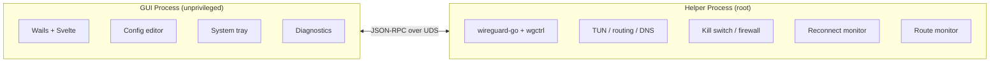

<p align="center">
  
</p>

<h1 align="center">WireGuide</h1>

<p align="center">
  <b>A WireGuard VPN client for people who don't want to think about WireGuard.</b>
</p>

<p align="center">
  <a href="https://github.com/korjwl1/wireguide/releases/latest"></a>
  <a href="https://github.com/korjwl1/wireguide/stargazers"></a>
  <a href="#install"></a>
  
  <a href="LICENSE"></a>
</p>

<p align="center">
  <a href="README.ko.md">한국어</a>
</p>

---

<table>
  <tr>
    <td align="center"><br><sub>VPN Connected</sub></td>
    <td align="center"><br><sub>Config Editor</sub></td>
  </tr>
  <tr>
    <td align="center"><br><sub>Autocomplete</sub></td>
    <td align="center"><br><sub>Settings</sub></td>
  </tr>
</table>

---

## Why WireGuide

Most WireGuard clients are built for the person who set up the server. WireGuide is built for the rest of the team.

Hand a `.conf` file to a non-technical coworker. They should be online in three steps:

1. Drag the file into WireGuide
2. Click **On**
3. (There is no step 3.)

That's the whole product from the user's side. Everything else is plumbing that quietly keeps the tunnel up, so the IT person doesn't have to keep fielding *"the VPN is broken again"* messages.

---

## Design

**Small surface, careful insides.**

The UI deliberately exposes a tiny number of things to click. Features that ship in WireGuide have to satisfy two rules:

1. They must not break the system when something goes wrong.
2. The everyday user must not need to know they exist.

That means most of WireGuide runs silently in the background.

### What the user sees

- Drag-and-drop `.conf` import (also QR and ZIP)
- A list of tunnels, each with one big toggle (sortable, resizable, optional compact mode)
- A tray icon that shows whether you're connected
- Per-tunnel **Automation** — connect or disconnect a tunnel automatically based on which network you're on (by Wi-Fi SSID, subnet, or the router's MAC address, with "is" / "is not" matching; rules are ordered by priority and drag-reorderable)
- A **command-line interface** (`wireguide ctl …`) for scripting — see below

### What runs silently underneath

- **Sleep/wake recovery** — the tunnel comes back after the lid closes
- **Route monitor** — keeps working when you move between Wi-Fi and Ethernet
- **Kill switch** — if the tunnel drops, nothing leaks while WireGuide is reconnecting. Uses the OS-native firewall (`pf` on macOS, WFP on Windows, `nftables` on Linux), not a userspace shim
- **Health check + auto-reconnect** — fixes a stalled handshake without the user noticing
- **DNS protection** — DNS queries are pinned to the tunnel
- **Conflict detection** — warns when another VPN (Tailscale, another WG interface) would step on routes

### For the person who set up the server

- Config editor with WireGuard syntax highlighting and autocomplete (CodeMirror 6)
- DNS leak test and route table view
- Real-time RX/TX dashboard
- Multi-tunnel — keep dev / staging / prod connected at once
- Per-tunnel notes and connection history

### Not included on purpose

- No account, no telemetry, no "Pro" tier
- No protocols other than WireGuard
- No bundled extras you didn't ask for

---

## Stability over features

WireGuide ships fewer knobs than most desktop VPN clients on purpose. The trade is that the few it does ship are meant to be boring and reliable.

- **Privilege separation.** A single binary runs in two modes. The GUI runs unprivileged. A small helper runs as root / Administrator. They talk over a local Unix socket (macOS/Linux) or named pipe (Windows). Nothing is exposed over HTTP or the network.
- **OS-native firewall.** The kill switch uses `pf` (macOS), WFP (Windows), or `nftables` (Linux) — not a userspace packet filter that fails open.
- **Up-to-date crypto.** Built on a May 2026 build of [wireguard-go](https://git.zx2c4.com/wireguard-go) — years ahead of the engine inside the official macOS app, which hasn't been updated since Feb 2023.
- **Manual QA per release.** Every tagged release is exercised on macOS (Apple Silicon), Windows 11 (amd64), and Linux (Debian 13 / Raspberry Pi OS ARM64) before it goes out, on top of a 3-OS `go test` matrix that gates every PR.

If something breaks, helper logs are plain text — not behind a paywall. Open an issue and attach them.

---

## Install

Tested on **macOS 15+ (Apple Silicon)**, **Windows 11 (amd64)**, and **Linux (Debian 13 / Raspberry Pi OS, amd64/arm64)** — see [what's actually been exercised](#tested-coverage) below.

### macOS (Homebrew) — recommended

```bash
brew tap korjwl1/tap
brew install --cask wireguide
```

### macOS (Manual)

Download from [Releases](https://github.com/korjwl1/wireguide/releases), unzip, move to `/Applications`.

> If macOS shows "app is damaged", run: `xattr -cr /Applications/WireGuide.app`

> The first launch of a new version asks for your administrator password once, to install or update the privileged helper. After that, opening the app (including at login) does not ask again.

### Windows (Installer)

Download the latest `WireGuide-windows-amd64.exe` (or `-arm64.exe`) installer from
[Releases](https://github.com/korjwl1/wireguide/releases) and run it. The NSIS
installer registers the helper service and shortcut.

> Windows SmartScreen may warn that the publisher is unknown — the binary is
> currently unsigned. Click "More info" → "Run anyway".

### Linux (DEB)

Download the `WireGuide-linux-amd64.deb` (or `-arm64.deb`) package from
[Releases](https://github.com/korjwl1/wireguide/releases) and install it:

```bash
sudo apt install ./WireGuide-linux-amd64.deb
```

The package registers the app menu entry and tray integration; the privileged
helper is started on demand through PolicyKit (no always-on service).

### Build from Source

```bash
brew install go node
go install github.com/go-task/task/v3/cmd/task@v3.45.4
go install github.com/wailsapp/wails/v3/cmd/wails3@v3.0.0-alpha.74

task build
./bin/wireguide
```

### Tested coverage

Manual QA runs on real hardware, but the hardware doesn't cover every
combination. What has actually been exercised:

| Platform | Tested on | Ethernet | Wi-Fi |
|----------|-----------|:--------:|:-----:|
| macOS | macOS 26.4 (Tahoe), Apple Silicon | ✅ | ✅ |
| Windows | Windows 11 (amd64), desktop PC | ✅ | ⚠️ not properly tested |
| Linux | Raspberry Pi OS Lite (arm64) | ⚠️ not tested | ✅ |

The untested cells matter most for Wi-Fi-dependent features — SSID-based
Automation rules and Wi-Fi↔Ethernet handover on Windows, and wired
gateway/subnet detection on Linux. **If you hit an error in one of those
gaps, please [open an issue](https://github.com/korjwl1/wireguide/issues/new/choose)**
— reports from hardware we don't have are the only way those cells get fixed.

---

## DNS

`DNS =` in `[Interface]` takes IP servers, search domains and split-DNS domains:

```ini
DNS = 10.0.0.1                          # all queries go to the tunnel (default)
DNS = 10.0.0.1, corp.example            # plus a search domain
DNS = 192.168.1.1, ~corp.lan, ~1.168.192.in-addr.arpa
```

- **No `~` token**: global mode. The tunnel's servers replace system DNS while connected and it is restored on disconnect.
- **Any `~name` token**: split mode. The servers are added as a supplemental resolver for the `~` domains only. System DNS (and your own search domains) are never touched, and DNS protection is never applied to the tunnel. Plain hostnames in the list become match and search domains, so bare names expand. At least one server IP is required, and the server must be reachable through `AllowedIPs`.
- Reverse zones (`~1.168.192.in-addr.arpa`) are not derived automatically; add them yourself.
- Split DNS works on macOS (SystemConfiguration supplemental resolver) and Linux with systemd-resolved (`resolvectl`). On Windows the tunnel connects without DNS handling.

On macOS a resolver for a matched domain does **not** fall back to your local DNS when it answers NXDOMAIN, so a name that only exists locally under a `~` domain will fail. `dig`, `nslookup` and `host` read `/etc/resolv.conf` and bypass supplemental resolvers; test with `dscacheutil -q host -a name <host>` (or `ping`/`curl`). Match domains ending in `.local` may be answered by mDNS instead of the tunnel.

---

## Command line

WireGuide ships a small CLI, `wireguide ctl`, for scripting and automation. Like
`tailscale`/`tailscaled`, it talks to the already-running (already-elevated)
helper over the local socket — so unlike `wg-quick` it needs no per-command
`sudo`, works the same on macOS/Windows/Linux, and shares the GUI's tunnel store.

```
wireguide ctl start                     # launch WireGuide (app + helper) and wait
wireguide ctl stop                      # quit WireGuide (app + helper)

wireguide ctl status [--json]           # connection status
wireguide ctl list [--json]             # list tunnels (● = connected)
wireguide ctl connect <name>            # connect a tunnel
wireguide ctl disconnect [name]         # disconnect one (or all)
wireguide ctl import <file> [name]      # import a .conf
wireguide ctl rename <old> <new>
wireguide ctl delete <name>

# Automation — per-tunnel connect/disconnect rules (top rule wins on conflict):
wireguide ctl automation                # what the engine decides right now
wireguide ctl automation rules <name>   # list a tunnel's rules
wireguide ctl automation add <name> <connect|disconnect> <cond>
    #   cond = ssid:<wifi>  subnet:<CIDR>  mac:<gateway-MAC>  else
    #   negated: not-ssid:<wifi>  not-subnet:<CIDR>  not-mac:<MAC>
wireguide ctl automation rm <name> <n>

# Settings & diagnostics:
wireguide ctl set killswitch <on|off>       # block non-VPN traffic if the tunnel drops
wireguide ctl set dns-protection <on|off>   # pin DNS to the tunnel
wireguide ctl set healthcheck <on|off>
wireguide ctl set pin-interface <on|off>
wireguide ctl set loglevel <debug|info|warn|error>
wireguide ctl dnsleak                        # check whether DNS leaks outside the tunnel
wireguide ctl routes                         # OS routing table
wireguide ctl diag bundle [--out path]       # diagnostics zip for bug reports (keys redacted)

# Teach coding agents (Claude Code, Codex, ...) how to drive the CLI:
wireguide ctl install-skills

# e.g. turn the work VPN off on the office network, on everywhere else:
wireguide ctl automation add work disconnect mac:b0:38:6c:54:8b:ab
wireguide ctl automation add work connect else

# e.g. a tunnel for a remote site: off at home, on anywhere else:
wireguide ctl automation add remote disconnect ssid:HomeWiFi
wireguide ctl automation add remote connect not-ssid:HomeWiFi
```

**"is not" rules.** A negated rule matches only when the value is known and
different. While it is unknown the tunnel is left alone and later rules are
*not* tried: a blank Wi-Fi name during a roam, a network that changed less
than ~15 seconds ago, or no default route. A blank Wi-Fi name on an Ethernet
or USB-tethered connection counts as "no Wi-Fi" and matches. Positive rules
are unchanged (no delay; unknown input just doesn't match). If you connect or
disconnect a tunnel by hand, automation leaves that tunnel alone until the
network changes. Tunnels with automation rules are also not restored by the
sleep/wake reconnect; the rules decide.

**Diagnostics bundle.** `wireguide ctl diag bundle` (or Settings → Logging →
"Export diagnostics…") writes a zip with the last 5 MB of the helper log, the
list of rotated log files, `config.json`, every tunnel `.conf` with
`PrivateKey` and `PresharedKey` replaced by `<redacted>`, the `.meta.json`
files, `history.json`, `scutil --dns`, `networksetup -getdnsservers` per
service, both WireGuide pf anchors (read by the helper, since `pfctl` needs
root), `netstat -nr`, the Automation preview, a DNS leak test and versions.
Private keys are never included; PreUp/PostUp lines are, so skim the bundle
before sharing it. The helper log rotates itself at 10 MB (five files,
`/var/log/wireguide-helper.log` to `.5`); launchd's own capture goes to
`/var/log/wireguide-helper.stderr.log` and holds startup output, fatal errors
from before logging is set up, and panics.

Connect/disconnect/status need the app (or its helper) running — start it with
`wireguide ctl start` (or by opening the app); nothing else starts a VPN stack
behind your back. list, import, rename, delete and automation edits work
directly against the local files.

---

## URL scheme and Shortcuts (macOS)

WireGuide registers `wireguide://` so Shortcuts, Focus filters, Raycast or a
shell (`open "wireguide://connect/Home"`) can drive it:

| URL | Effect |
| --- | --- |
| `wireguide://connect/<name>` | connect the tunnel named `<name>` |
| `wireguide://disconnect/<name>` | disconnect it |
| `wireguide://show` | bring the window forward |

Tunnel names are validated like everywhere else (letters, digits, `-`, `_`,
spaces; percent-encode spaces as `%20`). The scheme cannot import, delete,
rename or edit a config. A connect or disconnect always
shows a confirmation sheet in the window first, so a web page cannot silently
toggle your VPN. `wireguide://automation/pause` is not
implemented yet (it needs a helper-side latch); use `wireguide ctl` or a
manual connect/disconnect, which already pause automation for that tunnel
until the network changes.

**Shortcuts recipe:** add the *Open URLs* action (Safari category), set the URL
to `wireguide://connect/Home`, and name the shortcut "VPN on". Make a second
one with `disconnect` for "VPN off". Both then work from Spotlight, Siri, the
menu bar and Shortcuts automations. For Focus modes, a Shortcuts *Personal
Automation* triggered by the Focus turning on can run the same *Open URLs*
action. You will see the confirmation sheet each time.

---

## Architecture



- **Single binary** — `wireguide` runs as GUI or helper (`--helper` flag)
- **Privilege separation** — GUI is unprivileged; helper runs as root
- **IPC** — JSON-RPC over Unix socket (macOS/Linux) or named pipe (Windows)

---

## Tech Stack

| Component | Technology |
|-----------|-----------|
| Language | Go 1.25+ |
| GUI | [Wails v3](https://wails.io) |
| Frontend | Svelte + Vite |
| WireGuard | [wireguard-go](https://git.zx2c4.com/wireguard-go) + [wgctrl-go](https://github.com/WireGuard/wgctrl-go) |
| Editor | [CodeMirror 6](https://codemirror.net/) |
| Firewall | macOS `pf` / Linux `nftables` / Windows WFP (Filtering Platform) |
| i18n | English, Korean, Japanese |

---

## Contributing

See [CONTRIBUTING.md](CONTRIBUTING.md) for development setup and guidelines.

Found a bug? [Open an issue](https://github.com/korjwl1/wireguide/issues/new/choose).

---

## Code signing

Once the SignPath Foundation OSS approval completes, Windows installers will be
code-signed via SignPath. The signing policy is documented in
[SIGNING-POLICY.md](SIGNING-POLICY.md).

> Free code signing provided by [SignPath.io](https://signpath.io),
> certificate by [SignPath Foundation](https://signpath.org).

Until then, releases ship unsigned and SmartScreen shows the "unknown
publisher" warning on first run.

---

## Sponsor

<a href="https://github.com/sponsors/korjwl1">
  
</a>

If WireGuide is useful to you, consider sponsoring to support development.

---

## License

[MIT](LICENSE)
